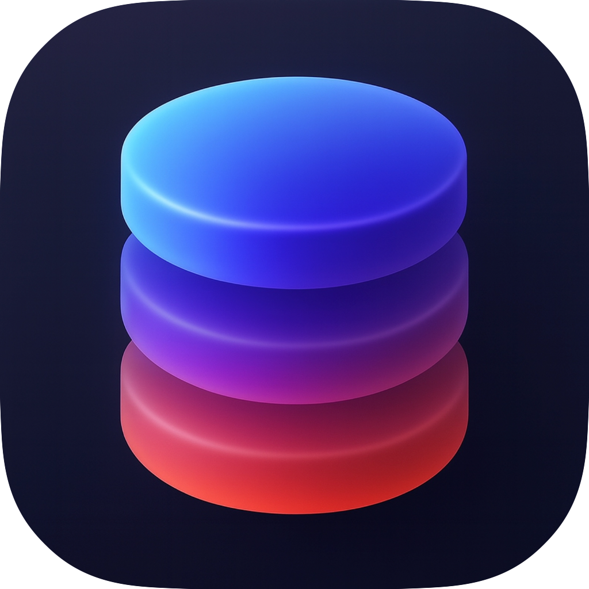

#  Echo

<br>

**Echo** is a fast, lightweight, and truly native macOS database management client. Built from the ground up with SwiftUI and AppKit, it provides a seamless, Mac-first experience without the overhead of Electron or Java-based wrappers. 

Connect to your favorite relational databases, execute complex queries, and manage your data with speed and elegance.

---

## ✨ Features

- **Truly Native:** Built with Swift and optimized for Apple Silicon and macOS 15+. Fast, responsive, and integrates deeply with native macOS features.
- **Multi-Database Support:** 
  - 🐘 PostgreSQL
  - 🐬 MySQL
  - 🪶 SQLite
  - 🏢 Microsoft SQL Server (MSSQL)
- **Advanced SQL Editor:** Syntax highlighting, smart autocomplete, and a responsive query editing experience.
- **High-Performance Results Table:** Stream and navigate massive datasets instantly with native, hardware-accelerated grid rendering.
- **Intuitive Object Browser:** Seamlessly explore schemas, tables, views, and routines.
- **Security & Role Management:** Built-in tools for managing database logins, roles, parameters, and security labels.
- **Dark Mode Support:** Beautifully adapts to your system theme.

---

## 🚀 Installation

### Via Homebrew (Recommended)
The easiest way to install and keep Echo updated is via Homebrew. Using the `--no-quarantine` flag is recommended to bypass macOS Gatekeeper (as the open-source releases are currently ad-hoc signed):

```bash
brew install --cask --no-quarantine tashda/tap/echo
```

### Manual Download
You can download the latest compiled `.zip` from the [Releases](https://github.com/tashda/Echo/releases) page. 

*Note: If you install manually without Homebrew, you may need to **Right-Click** the app and select **Open** the first time you launch it to bypass the macOS "unverified developer" warning.*

---

## 🔄 Auto-Updates
Echo uses the [Sparkle](https://sparkle-project.org) framework for secure automatic updates via EdDSA (Ed25519) cryptographic signatures. 

You can manually check for updates at any time via the menu bar: **Echo > Check for Updates...** or simply wait for the app to notify you when a new version is released.

---

## 🛠️ Developer Setup & CI/CD

Interested in building Echo from source or contributing? Echo uses the Swift Package Manager (SPM) and is built strictly for modern macOS architectures.

1. Clone the repository.
2. Open `Echo.xcodeproj` in **Xcode 16+**.
3. Let SPM resolve the required dependencies.
4. Select the `Echo` scheme and hit `Cmd + R` to build and run.

### Automated Releases
This repository is configured with a fully automated GitHub Actions pipeline (`.github/workflows/build-release.yml`).

- **Trigger:** Any push or pull-request merge to the `main` branch.
- **Process:** The workflow builds the app (Release configuration), packages it into a ZIP, signs the update with Sparkle keys, and publishes a new GitHub Release.
- **Appcast:** The Sparkle update feed (`appcast.xml`) is automatically generated and hosted alongside each release.

*(Note for maintainers: To run the pipeline, ensure `SPARKLE_PRIVATE_KEY` is set in the repository's Actions Secrets).*

---

## 📝 License

*(License information to be added)*
